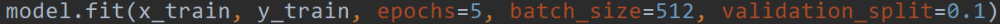

# 程序文档说明

程序主要分为处理数据集、建立模型、训练模型并测试、运行并预测结果这四个模块，下面依次介绍

## 数据集描述

本程序做到了识别数字和字母，他们的源文件都是二进制文件，需要进行一系列处理之后转换为标准的numpy数组之后才能进行后续的操作

#### 数字

数字的数据来自于[MNIST数据集](http://yann.lecun.com/exdb/mnist/)，训练集有60000个，测试集有10000个，源文件保存在**MNIST_number**文件夹下，是二进制文件，通过一系列数据处理之后转换为标准的28\*28的numpy数组，后续根据具体的模型还要再调整

#### 字母

字母的数据来自于[EMNIST数据集](https://www.nist.gov/node/1298471/emnist-dataset)，训练集有128000个，测试集有20800个，源文件保存在**EMNIST_letter**文件夹下，同样是二进制文件，但是原图片不是正常“姿势”，所以需要先镜像翻转+顺时针旋转90°变为正常的再在后续进行训练

## 算法及其模型简述

**这里仅是对工程中所使用的算法的简述**，由于存在外部的手写图片作为输入数据，所以在数据上会有调整，而且存在多种算法的选择，预测部分会有一个函数封装好方便调用不同的算法，后面会详细提到

### 卷积神经网络（CNN）

调用keras框架，构建卷积神经网络模型

#### 预处理输入数据

keras框架的CNN模型的输入格式为四维（图片数量，图片高度，图片宽度，图像通道数），本实验是灰度图，通道数为1，而上述所说的标准数据集经过第一步处理之后的是28*28的numpy数组，需要使用np.expand_dims扩展到四维

#### 建立模型

定义一个Sequential模型，中间添加了三层Conv2D卷积层

#### 训练模型

使用训练集训练模型，调用fit函数，参数设置为跑5轮epoch，一个batch有512个数据，将其中百分之十的训练数据作为测试集

#### 测试准确率

让模型在测试集上跑，得到测试数据上的正确率

#### 预测

直接调用.predict函数即可

### 

## 函数

## 模型存储说明

**文件夹models保存了实验中训练好的模型**

### 卷积神经网络

卷积神经网络的模型，又分为识别数字(**model_convolution_number.h5**)、字母(**model_convolution_letter.h5**)的两个模型，通过keras框架下的.save函数以及h5py包依赖存储为.h5文件，使用则load_model(path)

### 一般神经网络

一般的多层感知机的神经网络模型，在本实验中称为"baseline"，仅仅表示一个名称，有“基准”/“对照组”之意，分别为识别数字(**model_baseline_number.h5**)、字母(**model_baseline_letter.h5**)、数字字母合并(**model_baseline_combined.h5**)

### 分类器（SVM、KNN）

使用sklearn框架的SVM和KNN分类器并用joblib.dump保存模型为.m文件，使用时调用joblib.load(path)引入模型，**KNN(n=3)_letter.m**、**KNN(n=3)_number.m**、**SVM(C=1.0)_letter.m**、**SVM(C=1.0)_number.m**